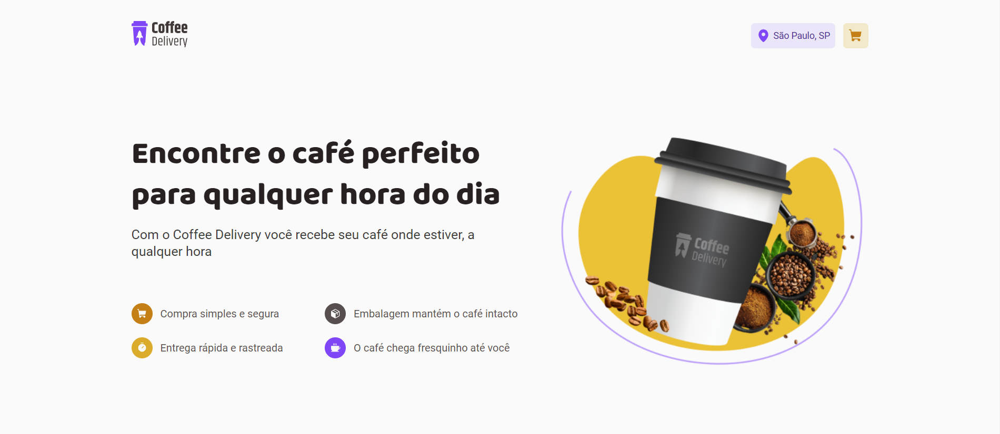

# Coffee Delivery

<!---Esses são exemplos. Veja https://shields.io para outras pessoas ou para personalizar este conjunto de escudos. Você pode querer incluir dependências, status do projeto e informações de licença aqui--->




> O Coffee Delivery foi desenvolvido como um dos desafios do curso Ignite ReactJS da @Rocketseat.

# [DEMO](https://test-reactjs-coffee-delivery-k5ow.vercel.app/)

### Tópicos estudados

O principal objetivo desse desafio é ensinar o aluno a utilizar as seguintes ferramentas:

- [x] Componentização
- [x] Estados
- [x] Propriedades
- [x] Navegação com o [React Router Dom](https://reactrouter.com/en/main)
- [x] Estilização com o [Styled Components](https://styled-components.com/docs)
- [x] [Figma](https://www.figma.com)
- [x] [Context API](https://reactjs.org/docs/context.html)
- [x] Utilizar formulários com o [React Hook Form](https://react-hook-form.com)

### Ajustes e melhorias

O projeto ainda está em desenvolvimento e as próximas atualizações serão voltadas nas seguintes tarefas:

- [x] Adicionar o React Toastify
- [x] Integração com a API da VIA CEP 
- [ ] Integrar o projeto com o Stripe
- [ ] Reponsividade
- [ ] Filtro por tipo de café

## 💻 Pré-requisitos

Antes de começar, verifique se você atendeu aos seguintes requisitos:
<!---Estes são apenas requisitos de exemplo. Adicionar, duplicar ou remover conforme necessário--->
* Você instalou a versão mais recente de `Vite`
* Você tem uma máquina `<Windows / Linux / Mac>`.

## ☕ Usando Coffee Delivery

Para usar Coffee Delivery, siga estas etapas:

```
git clone https://github.com/LeonardoVini/test-reactjs-coffee-delivery.git
```

```
yarn
```
```
yarn dev
```

## 📫 Contribuindo para o Coffee Delivery
<!---Se o seu README for longo ou se você tiver algum processo ou etapas específicas que deseja que os contribuidores sigam, considere a criação de um arquivo CONTRIBUTING.md separado--->
Para contribuir com <nome_do_projeto>, siga estas etapas:

1. Bifurque este repositório.
2. Crie um branch: `git checkout -b <nome_branch>`.
3. Faça suas alterações e confirme-as: `git commit -m '<mensagem_commit>'`
4. Envie para o branch original: `git push origin <nome_do_projeto> / <local>`
5. Crie a solicitação de pull.

Como alternativa, consulte a documentação do GitHub em [como criar uma solicitação pull](https://help.github.com/en/github/collaborating-with-issues-and-pull-requests/creating-a-pull-request).

## 📝 Licença

Esse projeto está sob licença. Veja o arquivo [LICENÇA](LICENSE.md) para mais detalhes.

[⬆ Voltar ao topo](#nome-do-projeto)<br>
